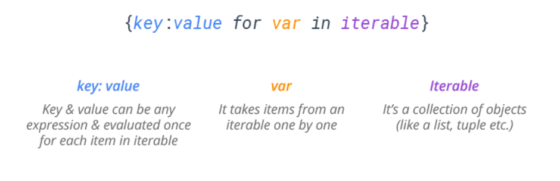
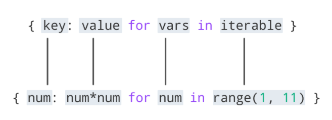

# Dict comprehension

source: `{{ page.path }}`

`Dictionary comprehension` is a way to build a new dictionary by applying an expression to each item in an iterable.
Dictionaries are data types in Python which allows us to store data in key/value pair. For example:
```python
D = {}
for x in range(5):
    D[x] = x**2

print(D)        # Prints {0: 0, 1: 1, 2: 4, 3: 9, 4: 16}
```
General syntax for a dictionary comprehension is:




```python
D = {c: c*3 for c in "RED"}
print(D)                        # {'R': 'RRR', 'E': 'EEE', 'D': 'DDD'}

L = ['ReD', 'GrEeN', 'BlUe']
D = {c.lower(): c.upper() for c in L}
print(D)                        # Prints {'blue': 'BLUE', 'green': 'GREEN', 'red': 'RED'}
```
#### Extracting a Subset of a Dictionary
Sometimes you want to extract particular keys from a dictionary. This is easily accomplished using a dictionary comprehension.
```python
D = {0:'A', 1:'B', 3:'C', 4:'D', 5:'E'}
keys = [0,3,5]
x = {k: D[k] for k in keys}
print(x)                        # {0: 'A', 3: 'C', 5: 'E'}
```
#### Filter Dictionary Contents
Suppose you want to make a new dictionary with selected keys removed. Here’s a simple code that deletes specified keys from a dictionary.
```python
D = {0:'A', 1:'B', 3:'C', 4:'D', 5:'E'}
remove = [0,3,5]
x = {k: D[k] for k in D.keys() - remove}
print(x)                        # {1: 'B', 4: 'D'}               
```
#### Invert Mapping / Reverse lookup
Given a dictionary d and a key k, it is easy to find the corresponding value v = d[k]. This operation is called a lookup.

But what if you want to retrieve a key k using a value v in a dictionary? You have to do `reverse lookup`. 
```python
D = {0: 'red', 1: 'green', 2: 'blue'}
R = {v: k for k,v in D.items()}
print(R)                        # Prints {'red': 0, 'green': 1, 'blue': 2}
```

#### Dictionary Comprehension with Enumerate
Sometimes you want to create a dictionary from the list with list index number as key and list element as value. To achieve this wrap the list in `enumerate()` function and pass it as an iterable to the dict comprehension.
```python
L = ['red', 'green', 'blue']
D = {k:v for k,v in enumerate(L)}
print(D)                        # Prints {0: 'red', 1: 'green', 2: 'blue'}

Such dictionaries with element index are often useful in a variety of scenarios such as reading a file by lines.

D = {ix: line for ix, line in enumerate(open('myFile.txt'))}
print(D)
# {0: 'First line\n',
#  1: 'Second line\n',
#  2: 'Third line\n'}
```
#### Initialize Dictionary with Comprehension
Dictionary comprehensions are also useful for initializing dictionaries from keys lists, in much the same way as the `fromkeys()` method. Following example Initializes a dictionary with default value ‘0’ for each key.
```python
keys = ['red', 'green', 'blue']

# using dict comprehension
D = {k: 0 for k in keys}
print(D)                        # Prints {'red': 0, 'green': 0, 'blue': 0}

# equivalent to using fromkeys() method
D = dict.fromkeys(keys, 0)
print(D)                        # Prints {'red': 0, 'green': 0, 'blue': 0}
```
A standard way to dynamically initialize a dictionary is to combine its keys and values with `zip`, and pass the result to the `dict()` function. However, you can achieve the same result with a dictionary comprehension.
```python
keys = ['name', 'age', 'job']
values = ['Bob', 25, 'Dev']

# using dict comprehension
D = {k: v for (k, v) in zip(keys, values)}
print(D)                        # Prints {'name': 'Bob', 'age': 25, 'job': 'Dev'}

# equivalent to using dict() on zipped keys/values
D = dict(zip(keys, values))
print(D)                        # Prints {'name': 'Bob', 'age': 25, 'job': 'Dev'}
```
#### Dictionary Comprehension with if Clause
A dictionary comprehension may have an optional associated if clause to filter items out of the result.

Iterable’s items are skipped for which the if clause is not true.
```tip
Python Dictionary Comprehension If Clause Syntax
        {key:value for var in iterable if_clause}
```
The following example collects squares of even items (i.e. items having no remainder for division by 2) in a range.
```python

D = {x: x**2 for x in range(6) if x % 2 == 0}

print(D)                        # Prints {0: 0, 2: 4, 4: 16}

This dictionary comprehension is the same as a for loop that contains an if statement:

D = {}
for x in range(5):
    if x % 2 == 0:
        D[x] = x**2

print(D)                         # Prints {0: 0, 2: 4, 4: 16}
```        
#### Nested Dictionary Comprehension
The initial value in a dictionary comprehension can be any expression, including another dictionary comprehension.
```tip
Python Nested Dictionary Comprehension Syntax:
        {key:{dict comprehension} for var in iterable}
```
For example, here’s a simple list comprehension that uses a nested for clause.
```python
D = {(k,v): k+v for k in range(2) for v in range(2)}
print(D)                        # Prints {(0, 1): 1, (1, 0): 1, (0, 0): 0, (1, 1): 2}

# is equivalent to
D = {}
for k in range(2):
    for v in range(2):
        D[(k,v)] = k+v
print(D)                        # Prints {(0, 1): 1, (1, 0): 1, (0, 0): 0, (1, 1): 2}