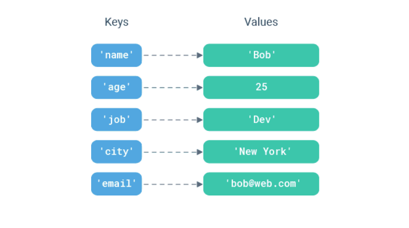

# Dictionary
source: `{{ page.path }}`

Python dictionary is an unordered collection of items. Each item of a dictionary has a key/value pair.Dictionaries are optimized to retrieve values when the key is known.

Creating a dictionary is as simple as placing items inside curly braces {} separated by commas.An item has a key and a corresponding value that is expressed as a pair (key: value).

While the values can be of any data type and can repeat, keys must be of immutable type (string, number or tuple with immutable elements) and must be unique.

