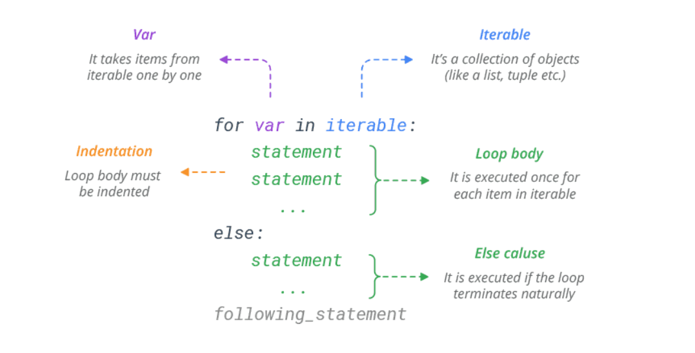

# For Loop

source: `{{ page.path }}`

The for statement in Python is a bit different from what you usually use in other programming languages.

Rather than iterating over a numeric progression, Python’s for statement iterates over the items of any iterable **(list, tuple, dictionary, set, or string)**. The items are iterated in the order that they appear in the iterable.

#### For Loop 


 
 ```python
# Iterate through a list
colors = ['red', 'green', 'blue', 'yellow']
for x in colors:
    print(x)
# Prints red green blue yellow

# Iterate through a string
S = 'python'
for x in S:
    print(x)
# Prints p y t h o n

```

#### Break in for Loop
Python break statement is used to exit the loop immediately. It simply jumps out of the loop altogether, and the program continues after the loop.

```python
# Break the loop at 'blue'
colors = ['red', 'green', 'blue', 'yellow']
for x in colors:
    if x == 'blue':
        break
    print(x)
# Prints red green
```

#### Continue in for Loop
The continue statement skips the current iteration of a loop and continues with the next iteration.

```python
# Skip 'blue' and execute other colors in list
colors = ['red', 'green', 'blue', 'yellow']
for x in colors:
    if x == 'blue':
        continue
    print(x)
# Prints red green yellow
```

#### Else in for Loop
Python allows an optional else clause at the end of a for loop. The else clause will be executed if the loop terminates naturally (through exhaustion).

```python
colors = ['red', 'green', 'blue', 'yellow']
for x in colors:
    print(x)
else:
    print('Done!')
# Prints red green blue yellow
# Prints Done!

## If the loop terminates prematurely with break, the else clause won’t be executed.

colors = ['red', 'green', 'blue', 'yellow']
for x in colors:
    if x == 'blue':
        break
    print(x)
else:
    print('Done!')
# Prints red green

```

#### range() function in for loop
If you need to execute a group of statements for a specified number of times, use built-in function range().

The **range(start,stop,step)** function generates a sequence of numbers from 0 up to (but not including) specified number.

```python
# Generate a sequence of numbers from 0 6
for x in range(7):
    print(x)
# Prints 0 1 2 3 4 5 6

range() provides a simple way to repeat an action a specific number of times.

# Print 'Hello!' three times
for x in range(3):
    print('Hello!')
# Prints Hello!
# Prints Hello!
# Prints Hello!

The range starts from 0 by default. But, you can start the range at another number by specifying start parameter.

# Generate a sequence of numbers from 2 to 6
for x in range(2, 7):
    print(x)
# Prints 2 3 4 5 6

# Increment the range with 2
for x in range(2, 7, 2):
    print(x)
# Prints 2 4 6
```

#### Nested for Loop

A loop inside another loop is called a nested loop.
```python
# Flatten a nested list
list = [[1, 2, 3],[4, 5, 6],[7, 8, 9]]   
for sublist in list:
    for number in sublist:
        print(number)
# Prints 1 2 3 4 5 6 7 8 9
```

#### Access Index in for Loop
To iterate over the indices of a sequence, you can combine range() and len() as follows:

```python
colors = ['red', 'green', 'blue']
for index in range(len(colors)):
    print(index, colors[index])
# Prints 0 red
# Prints 1 green
# Prints 2 blue

However, in most such cases it is convenient to use the enumerate() function.

colors = ['red', 'green', 'blue']
for index, value in enumerate(colors):
    print(index, value)
# Prints 0 red
# Prints 1 green
# Prints 2 blue
```
#### Unpacking in a for loop
Below for loop does a multiple assignment (unpack the current tuple) each time through the loop.

```python
# Tuple unpacking
T = [(1, 2), (3, 4), (5, 6)]
for (a, b) in T:
    print(a, b)
# Prints 1 2
# Prints 3 4
# Prints 5 6

Likewise, you can iterate through both keys and values in a dictionary.

# Dictionary unpacking
D = {'name': 'Bob', 'age': 25}
for x, y in D.items():
	print(x, y)
# Prints age 25
# Prints name Bob
```

#### Modify a List While Iterating
Don’t alter mutable objects while looping on them. It may create an infinite loop.

```python
# infinite loop
colors = ['red', 'green', 'blue']
for x in colors:
    if x == 'red':
        colors.insert(0, 'orange')
        print(colors)
```
It is recommended that you first make a copy. The slicing operator makes this especially convenient.

```python
colors = ['red', 'green', 'blue']
for x in colors[:]:
	if x == 'red':
		colors.insert(0, 'orange')
print(colors)
# Prints ['orange', 'red', 'green', 'blue']
```
#### Looping Through Multiple Lists
Using built-in **zip()** function you can loop through multiple lists at once.

```python
# Loop through two lists at once
name = ['Bob', 'Sam', 'Max']
age = [25, 35, 30]
for x, y in zip(name, age):
    print(x, y)
# Prints Bob 25
# Prints Sam 35
# Prints Max 30
```