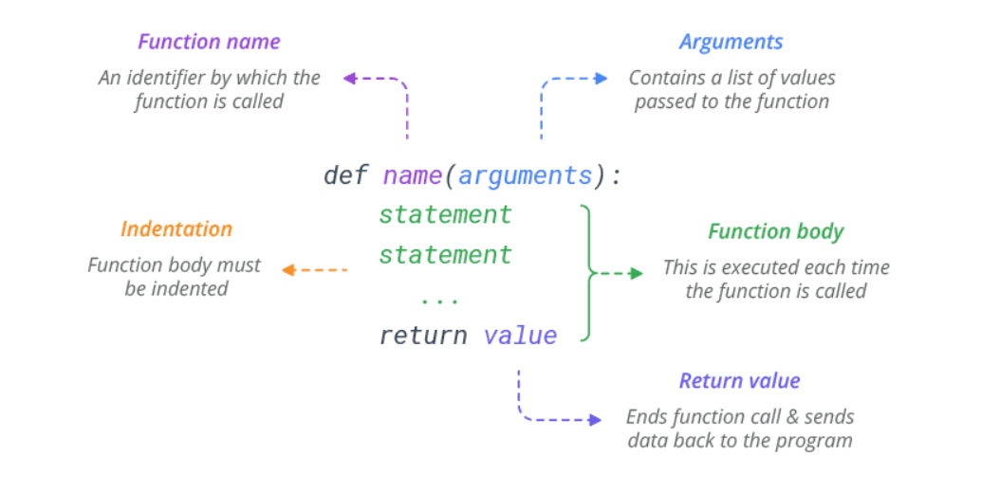

# Functions

source: `{{ page.path }}`

Functions are the first step to code reuse. They allow you to define a reusable block of code that can be used repeatedly in a program.

Python provides several built-in functions such as print(), len() or type(), but you can also define your own functions to use within your programs



#### Create a Function
To define a Python function, use def keyword. Here’s the simplest possible function that prints ‘Hello, World!’ on the screen.

```python
def hello():
    print('Hello, World!')
```
#### Call a Function
The def statement only creates a function but does not call it. After the def has run, you can can call (run) the function by adding parentheses after the function’s name.
```python
def hello():
    print('Hello, World!')
  
hello()
# Prints Hello, World!
```
#### Pass Arguments
You can send information to a function by passing values, known as arguments. Arguments are declared after the function name in parentheses.

When you call a function with arguments, the values of those arguments are copied to their corresponding parameters inside the function.
```python
# Pass single argument to a function
def hello(name):
    print('Hello,', name)

hello('Bob')
# Prints Hello, Bob
hello('Sam')
# Prints Hello, Sam
```
You can send as many arguments as you like, separated by commas ,.
```python
# Pass two arguments
def func(name, job):
    print(name, 'is a', job)

func('Bob', 'developer')
# Prints Bob is a developer
```

#### Types of Arguments
Python handles function arguments in a very flexible manner, compared to other languages. It supports multiple types of arguments in the function definition. Here’s the list:

* Positional Arguments
* Keyword Arguments
* Default Arguments
* Variable Length Positional Arguments (*args)
* Variable Length Keyword Arguments (**kwargs)

#### Positional Arguments
The most common are positional arguments, whose values are copied to their corresponding parameters in order.
```python
def func(name, job):
    print(name, 'is a', job)

func('Bob', 'developer')
# Prints Bob is a developer
```
The only downside of positional arguments is that you need to pass arguments in the order in which they are defined.
```python            
def func(name, job):
    print(name, 'is a', job)

func('developer', 'Bob')
# Prints developer is a Bob
```

#### Keyword Arguments
To avoid positional argument confusion, you can pass arguments using the names of their corresponding parameters.

In this case, the order of the arguments no longer matters because arguments are matched by name, not by position.

```python
# Keyword arguments can be put in any order
def func(name, job):
    print(name, 'is a', job)

func(name='Bob', job='developer')
# Prints Bob is a developer

func(job='developer', name='Bob')
# Prints Bob is a developer
```
It is possible to combine positional and keyword arguments in a single call. If you do so, specify the positional arguments before keyword arguments.

#### Default Arguments
You can specify default values for arguments when defining a function. The default value is used if the function is called without a corresponding argument.

In short, defaults allow you to make selected arguments optional.
```python
# Set default value 'developer' to a 'job' parameter
def func(name, job='developer'):
    print(name, 'is a', job)

func('Bob', 'manager')
# Prints Bob is a manager

func('Bob')
# Prints Bob is a developer
```

#### Variable Length Arguments (*args and **kwargs)
Variable length arguments are useful when you want to create functions that take unlimited number of arguments. Unlimited in the sense that you do not know beforehand how many arguments can be passed to your function by the user.

This feature is often referred to as var-args.

##### *args
When you prefix a parameter with an asterisk * , it collects all the unmatched positional arguments into a tuple. Because it is a normal tuple object, you can perform any operation that a tuple supports, like indexing, iteration etc.

Following function prints all the arguments passed to the function as a tuple.
```python
def print_arguments(*args):
    print(args)

print_arguments(1, 54, 60, 8, 98, 12)
# Prints (1, 54, 60, 8, 98, 12)
```
You don’t need to call this keyword parameter args, but it is standard practice.

##### **kwargs
The ** syntax is similar, but it only works for keyword arguments. It collects them into a new dictionary, where the argument names are the keys, and their values are the corresponding dictionary values.
```python
def print_arguments(**kwargs):
    print(kwargs)

print_arguments(name='Bob', age=25, job='dev')
# Prints {'name': 'Bob', 'age': 25, 'job': 'dev'}
```
#### Return Value
To return a value from a function, simply use a return statement. Once a return statement is executed, nothing else in the function body is executed.
```python
# Return sum of two values
def sum(a, b):
    return a + b

x = sum(3, 4)
print(x)
# Prints 7
```
Remember! a python function always returns a value. So, if you do not include any return statement, it automatically returns None.

#### Return Multiple Values
Python has the ability to return multiple values, something missing from many other languages. You can do this by separating return values with a comma.
```python
# Return addition and subtraction in a tuple
def func(a, b):
    return a+b, a-b

result = func(3, 2)

print(result)
# Prints (5, 1)
```

When you return multiple values, Python actually packs them in a single tuple and returns it. You can then use multiple assignment to unpack the parts of the returned tuple.

```python
# Unpack returned tuple
def func(a, b):
    return a+b, a-b

add, sub = func(3, 2)

print(add)
# Prints 5
print(sub)
# Prints 1
```

#### Docstring
You can attach documentation to a function definition by including a string literal just after the function header. Docstrings are usually triple quoted to allow for multi-line descriptions.
```python
def hello():
    """This function prints
       message on the screen"""  
    print('Hello, World!')
```
To print a function’s docstring, use the Python help() function and pass the function’s name.
```python
# Print docstring in rich format
help(hello)

# Help on function hello in module __main__:
# hello()
#    This function prints
#    message on the screen
```
You can also access the docstring through __doc__ attribute of the function.
```python
# Print docstring in a raw format
print(hello.__doc__)

# Prints This function prints message on the screen
```
#### Composition
One of the most useful features of Python is its ability to take small building blocks and compose them. For example, the argument of a function can be any type of expression, including arithmetic operators:
```python
import math
x = math.sin(360*2*math.pi)
print(x)
# Prints -3.133115067780141e-14
```
And even function calls:
```python
import math
x = math.exp(math.log(3.14))
print(x)
# Prints 3.1399999999999997
```

#### Nested Functions
A Nested function is a function defined within other function. They are useful when performing complex task multiple times within another function, to avoid loops or code duplication.

```python
def outer(a, b):
    def inner(c, d):
        return c + d
    return inner(a, b)

result = outer(2, 4)

print(result)
# Prints 6
```
A nested function can act as a closure.

#### Recursion
A recursive function is a function that calls itself and repeats its behavior until some condition is met to return a result.

In below example, countdown() is a recursive function that calls itself (recurse) to countdown. If num is 0 or negative, it prints the word “Stop”. Otherwise, it prints num and then calls itself, passing num-1 as an argument.
```python
def countdown(num):
    if num <= 0:
        print('Stop')
    else:
        print(num)
        countdown(num-1)

countdown(5)
# Prints 5
# Prints 4
# Prints 3
# Prints 2
# Prints 1
# Prints Stop
```
#### Assigning Functions to Variables
When Python runs a def statement, it creates a new function object and assigns it to the function’s name. You can assign a different name to it anytime and call through the new name.

For example, let’s assign a different name ‘hi’ to our ‘hello’ function and call through its new name.
```python
def hello():
    print('Hello, World!')
  
hi = hello
hi()
# Prints Hello, World!
You can use this feature to implement jump table. Jump table is a dictionary of functions to be called on demand.

def findSquare(x):
    return x ** 2

def findCube(x):
    return x ** 3

# Create a dictionary of functions
exponent = {'square': findSquare, 'cube': findCube}

print(exponent['square'](3))
# Prints 9
print(exponent['cube'](3))
# Prints 27
```
#### Python Function Executes at Runtime
Because Python treats def as an executable statement, it can appear anywhere a normal statement can.

For example you can nest a function inside an if statement to select between alternative definitions.
```python
x = 0
if x:
    def hello():
        print('Hello, World!')
else:
    def hello():
        print('Hello, Universe!')

hello()
# Prints Hello, Universe!
```