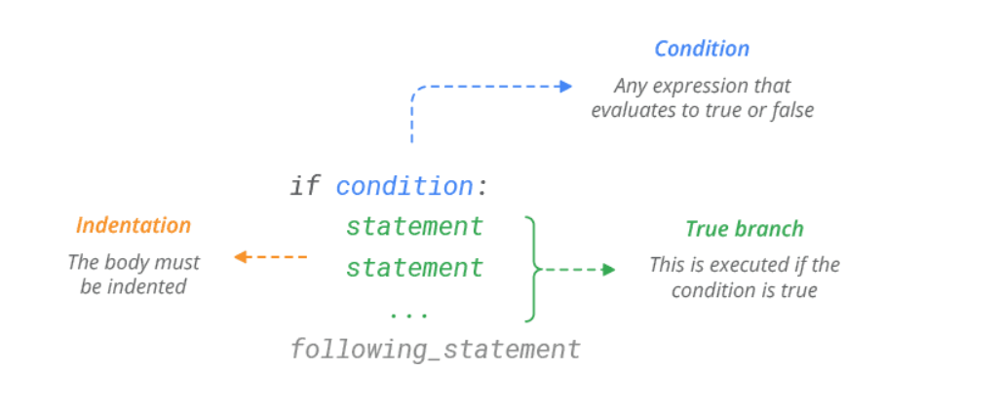
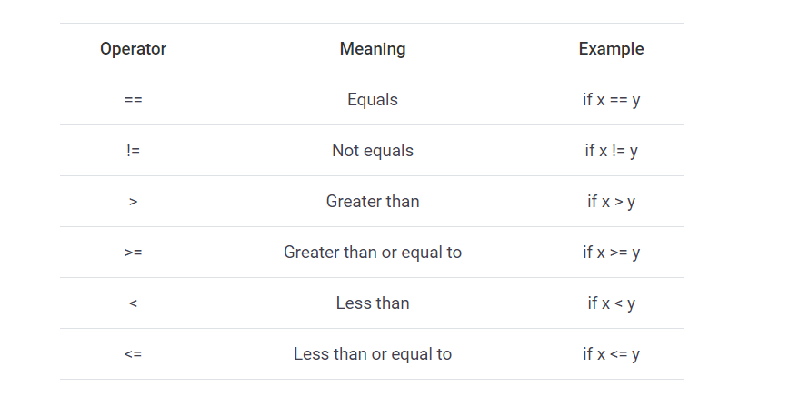
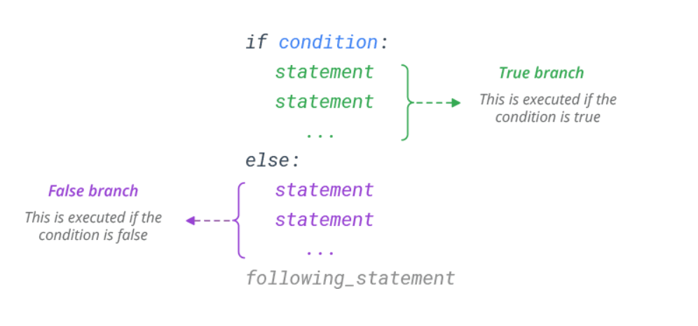
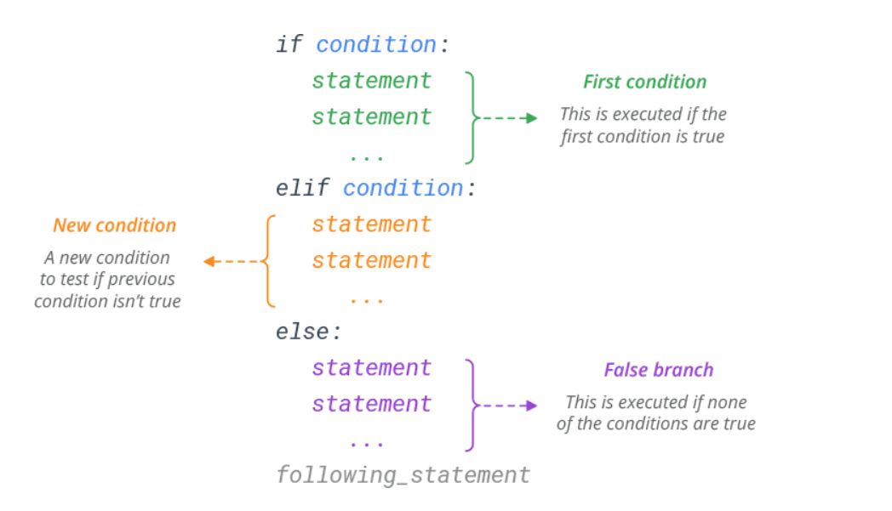
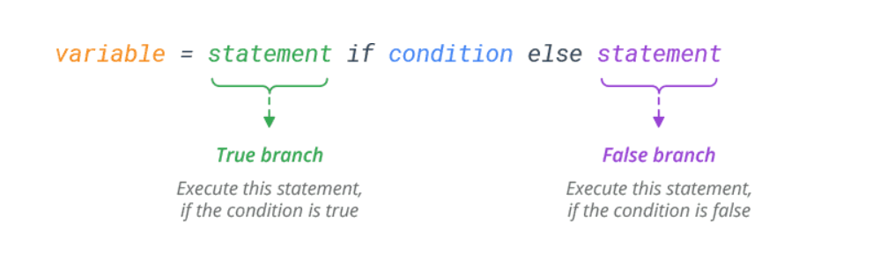

# IF ELSE

source: `{{ page.path }}`

Python if else elif Statement

* **if Statement:** use it to execute a block of code, if a specified condition is true
* **else Statement:** use it to execute a block of code, if the same condition is false
* **elif (else if) Statement:** use it to specify a new condition to test, if the first condition is false

#### The if Statement

Use if statement to execute a block of Python code, if the condition is true.

Syntax:



```python
x, y = 7, 5
if x > y:
	print('x is greater')
# Prints x is greater

# mathematical expression
x, y = 7, 5
if x + y:
    print('True')
# Prints True
```


#### The else Statement
Use else statement to execute a block of Python code, if the condition is false.

Syntax: 



```python
x, y = 7, 5
if x < y:
    print('y is greater')
else:
    print('x is greater')

# Prints x is greater
```
#### The elif (else if) Statement
Use elif statement to specify a new condition to test, if the first condition is false.



```python
x, y = 5, 5
if x > y:
    print('x is greater')
elif x < y:
    print('y is greater')
else:
    print('x and y are equal')

# Prints x and y are equal

```

#### Python nested if else statement
In nested if else statements, if statement is nested inside an if statements. So, the nested if statements will be executed only if the expression of main if statement returns TRUE.

Syntax of nested if else in Python.

```python
if test_expression:
  if test_expression:
     block of code
  else:
     block of code
else:
  block of code
```

This syntax shows an if else statement nested inside an if else statement.

```python
num = float(input("Enter a number: "))
if num >= 0:
    if num == 0:
        print("Zero")
    else:
        print("Positive number")
else:
    print("Negative number")
```    

#### Substitute for Switch Case
Unlike other programming languages, Python does not have a ‘switch‘ statement. You can use if…elif…elif sequence as a substitute.

```python
if choice == 1:
	print('case 1')
elif choice == 2:
	print('case 2')
elif choice == 3:
	print('case 3')
elif choice == 4:
	print('case 4')
else:
	print('default case')
```   
#### Multiple Conditions
To join two or more conditions into a single if statement, use logical operators viz. and, or and not.

`and expression` is `True`, if all the conditions are true. 
`or expression` is `True`, if at least one of the conditions is True.
`not expression` is `True`, if the condition is false

```python
# and expression is True, if all the conditions are true.
x, y, z = 7, 4, 2
if x > y and x > z:
    print('x is greater')

# Prints x is greater

# or expression is True, if at least one of the conditions is True.
x, y, z = 7, 4, 9
if x > y or x > z:
    print('x is greater than y or z')

# Prints x is greater than y or z

# not expression is True, if the condition is false
x, y = 7, 5
if not x < y:
    print('x is greater')

# Prints x is greater
```
#### Conditional Expressions (ternary operator)
Conditional expression (sometimes referred to as ‘ternary operator’) allows us to select one of two statements depending on the specified condition.

The syntax of the conditional expression is 

```python
x, y = 7, 5
print('x is greater') if x > y else print('y is greater')

# Prints x is greater
You can also use it to select variable assignment.

x, y = 7, 5
max = x if x > y else y
print(max)
# Prints 7
```

#### Check If Item Present in a Sequence
The in operator is used to check if a value is present in a sequence `(list, tuple, string etc.).`

```python
# list
L = ['red', 'green', 'blue']
if 'red' in L:
    print('yes')
# Prints yes

# tuple
T = ('red', 'green', 'blue')
if 'red' in T:
    print('yes')
# Prints yes

# string
S = 'Hello, World!'
if 'Hello' in S:
    print('Yes')
# Prints yes
```