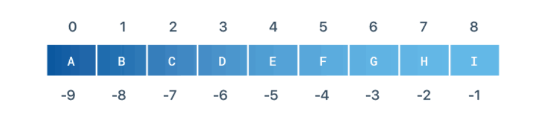

# Strings

source: `{{ page.path }}`

A string is a sequence of characters. You must have used strings in other languages as well. Python strings play the same role as character arrays in languages like C, but they are somewhat higher-level tools than arrays.

Unlike languages such as C, in Python, strings come with a powerful set of processing tools.

#### Create a String
A python string is zero or more characters written inside single quotes ' ' or double quotes " "
```python
S = 'Hello, World!'   # single quotes
S = "Hello, World!"   # double quotes
```

#### Multiline Strings
You can create a multiline string using triple-quotes: """  """ or '''  '''.
```python
S = """String literals can
span multiple lines."""
print(S)
# String literals can
# span multiple lines.
The str() Constructor
You can convert almost any object in Python to a string using a type constructor called str()

# an integer to a string
S = str(42)
print(S)
# Prints '42'

# a complex number to a string
S = str(3+4j)
print(S)
# Prints '(3+4j)

# a list to a string
S = str([1,1])
print(S)
# Prints '[1, 1]'
```

#### Access Characters by Index
You can access individual characters in a string using an index in square brackets. The string indexing starts from 0.

You can also access a string by negative indexing. A negative string index counts from the end of the string.

The indices for the elements in a string are illustrated as below:


```python
String Indexing
# Indexing
S = 'ABCDEFGHI'
print(S[0])    # Prints A
print(S[4])    # Prints E

# Negative Indexing
S = 'ABCDEFGHI'
print(S[-1])    # Prints I
print(S[-6])    # Prints D
```
#### Slicing a String
A segment of a string is called a slice and you can extract one by using a slice operator. A slice of a string is also a string.

The slice operator [n:m] returns the part of the string from the “n-th” item to the “m-th” item, including the first but excluding the last.
```python
S = 'ABCDEFGHI'
print(S[2:5])      # Prints CDE
print(S[5:-1])     # Prints FGH
print(S[1:6:2])    # Prints BDF
```
The string slicing capability provided by python is extensive and covered in full detail here.

#### Modify a String
It is tempting to use the [] operator on the left side of an assignment, in order to convert a character into a string. for example:
```python
S = 'Hello, World!'
S[0] = 'J'
# Triggers TypeError: 'str' object does not support item assignment
The reason for the error is that the strings are unchangeable (immutable) and because of which you cannot change the existing string. The best you can do is create a new string that is a variation of the original:

S = 'Hello, world!'
new_S = 'J' + S[1:]
print(new_S)
# Prints Jello, world!
```
#### String Concatenation
You can concatenate strings using the concatenation operator + or the augmented assignment operator +=
```python
# concatenation operator
S = 'Hello,' + ' World!'
print(S)
# Hello, World!

# augmented assignment operator
S = 'Hello,'
S += ' World!'
print(S)
# Prints Hello, World!

In Python, two or more strings next to each other are automatically concatenated, known as Implicit concatenation.

S = 'Hello,' " World!"
print(S)
# Prints Hello, World!
Implicit concatenation only works with two literals though, not with variables or expressions.

You can also put several strings within parentheses to join them together. This feature is useful when you want to break long strings.

S = ('Put strings within parentheses '
    'to join them together.')
print(S)
# Put strings within parentheses to join them together.
```
You can replicate substrings in a string using the replication operator *
```
# the hard way
S = '--------------------'

# the easy way
S = '-' * 20
```
#### Find String Length
To find the number of characters in a string, use len() built-in function.
```python
S = 'Supercalifragilisticexpialidocious'
print(len(S))
# Prints 34
```
#### Replace Text Within a String
Sometimes you want to replace a text inside a string, then you can use the replace() method.
```python
S = 'Hello, World!'
x = S.replace('World', 'Universe')
print(x)
# Prints Hello, Universe!
```
#### Split and Join a String
Use split() method to chop up a string into a list of substrings, around a specified delimiter.
```python
# Split the string on comma
S = 'red,green,blue,yellow'
x = S.split(',')
print(x)
# Prints ['red', 'green', 'blue', 'yellow']
print(x[0])
# Prints red

And use join() method to join the list back into a string, with a specified delimiter in between.

# Join the list of substrings
L = ['red', 'green', 'blue', 'yellow']
S = ','.join(L)
print(S)
# Prints red,green,blue,yellow
```
#### String Case Conversion
Python provides five methods to perform case conversion on the target string viz. lower(), upper(), capitalize(), swapcase() and title()
```python
S = 'Hello, World!'
print(S.lower())
# Prints hello, world!

S = 'Hello, World!'
print(S.upper())
# Prints HELLO, WORLD!

S = 'Hello, World!'
print(S.capitalize())
# Prints Hello, world!

S = 'Hello, World!'
print(S.swapcase())
# Prints hELLO, wORLD!

S = 'hello, world!'
print(S.title())
# Prints Hello, World!
```
#### Check if Substring Contains in a String
To check if a specific text is present in a string, use in operator. The in is a boolean operator, which takes two strings and returns True if the first appears as a substring in the second:

```python
S = 'Hello, World!'
print('Hello' in S)
# Prints True
```
To search for a specific text within a string, use find() method. It returns the lowest index in the string where substring is found.

```python
# Search for 'Foolish' within a string
S = 'Stay Hungry, Stay Foolish'
x = S.find('Foolish')
print(x)
# Prints 18

```
#### Iterate Through a String
To iterate over the characters of a string, use a simple for loop.
```python
# Print each character in a string
S = 'Hello, World!'
for letter in S:
    print(letter, end=' ')
# H e l l o ,   W o r l d !
``` 
#### Python Escape Sequence
You can use quotes inside a string, as long as they don’t match the quotes surrounding the string.
```python
S = "We're open"		# Escape single quote
S = "I said 'Wow!'"		# Escape single quotes
S = 'I said "Wow!"'		# Escape double quotes
```
This is fine for most of the time but what if you want to declare a string with both single and double quotes like:

`Bob told me, “Sam said, ‘This won’t work.'”`

Python will raise a `SyntaxError`, because both quotation marks are special characters. The solution to avoid this problem is to use the backslash escape character \.

Prefixing a special character with \ turns it into an ordinary character. This is called escaping.
```python
S = "Bob told me, \"Sam said, 'This won't work.'\""
print(S)
# Prints Bob told me, "Sam said, 'This won't work.'"
Backslash escape character is used in representing certain special characters like: \n is a newline, \t is a tab. These are known as escape sequences.

S = str('First line.\n\tSecond line.')
print(S)
# First line.
#     Second line.
```
#### String Methods

|Function	    |Description                                                                                                                    |
|---------------|-------------------------------------------------------------------------------------------------------------------------------|
|encode()	    |Python string encode() function is used to encode the string using the provided encoding.                                      |
|count()	    |Python String count() function returns the number of occurrences of a substring in the given string.                           |
|startswith()	|Python string startswith() function returns True if the string starts with the given prefix, otherwise it returns False.       |
|endswith()	    |Python string endswith() function returns True if the string ends with the given suffix, otherwise it returns False.           |
|capitalize()	|Python String capitalize() function returns the capitalized version of the string.                                             |
|center()	    |Python string center() function returns a centered string of specified size.                                                   |
|casefold()	    |Python string casefold() function returns a casefolded copy of the string. This function is used to perform case-insensitive   | |               |string comparison.                                                                                                             |
|expandtabs()	|Python string expandtabs() function returns a new string with tab characters (\t) replaced with one or more whitespaces.       |
|index()	    |Python String index() function returns the lowest index where the specified substring is found.                                |
| __contains__()|Python String class has __contains__() function that we can use to check if it contains another string or not. We can also use | |               | “in” operator to perform this check.                                                                                          |

