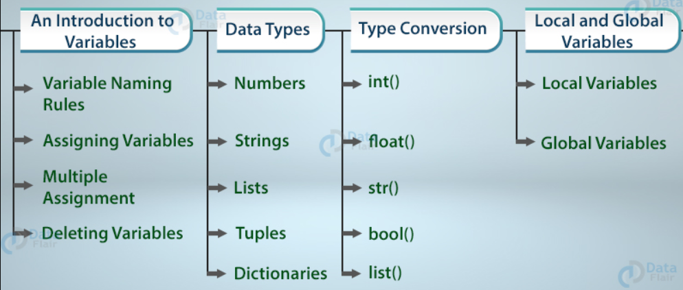

# Variables

source: `{{ page.path }}`

A variable is a container for a value. It can be assigned a name, you can use it to refer to it later in the program. Based on the value assigned, the interpreter decides its data type. You can always store a different type in a variable.

1. Python Variables Naming Rules

There are certain rules to what you can name a variable(called an identifier).
*  Python variables can only begin with a letter(A-Z/a-z) or an underscore(_).but it cannot start with a digit.
*  The name of the variable should start with either an alphabet letter (lower or upper case) or an underscore (_), 
More than one alpha-numeric characters or underscores may follow.
*  The variable name can consist of alphabet letter(s), number(s) and underscore(s) only. For example, myVar, MyVar, _myVar, MyVar123 are valid variable names but m*var, my-var, 1myVar are invalid variable names.
*  Identifiers in Python are case sensitive. So, NAME, name, nAME, and nAmE are treated as different variable names.

```
Reserved words (keywords) cannot be used as identifier names.

and         def	    False       import	    not 	True
as	        del	    finally	    in	        or	    try
assert	    elif	for	        is	        pass	while
break	    else	from	    lambda	    print	with
class	    except	global	    None	    raise	yield
continue	exec	if	        nonlocal	return
```

2. Assigning and Reassigning Python Variables

To assign a value to Python variables, you don’t need to declare its type. You name it according to the rules stated in section 2a, and type the value after the equal sign.

```
age=7
print(age) 
7 

age='Dinosaur'
print(age) 
Dinosaur
```

3. Multiple Assignment
You can assign values to multiple Python variables in one statement.

```
age,city=21,'Indore'
print(age,city)
21 Indore

 Or you can assign the same value to multiple Python variables.

age=fav=7
print(age,fav)
7 7
```

4. Swapping Variables
Swapping means interchanging values. To swap Python variables, you don’t need to do much.

```
a,b='red','blue'
a,b=b,a
print(a,b)
blue red

```
5. Deleting Variables
You can also delete Python variables using the keyword ‘del’.
```
a='red'
del a
a
```
image: 

### Python Data Types
Although we don’t have to declare a type for Python variables, a value does have a type. This information is vital to the interpreter. Python supports the following Python data types.

#### 1. Python Numbers
There are four numeric Python data types.

1.1. `int`
int stands for integer. This Python Data Type holds signed integers. We can use the type() function to find which class it belongs to.

```
a=-7
type(a)
<class ‘int’>

An integer can be of any length, with the only limitation being the available memory.

a=9999999999999999999999999999999
type(a)
<class ‘int’>

```
1.2. `float`
This Python Data Type holds floating-point real values. An int can only store the number 3, but float can store 3.25 if you want.

```
a=3.0
type(a)
<class ‘float’>
```
1.3. `long`
This Python Data type holds a long integer of unlimited length. But this construct does not exist in Python 3.x.

1.4. `complex`
This Python Data type holds a complex number. A complex number looks like this: a+bj Here, a and b are the real parts of the number, and j is imaginary.
```
a=2+3j
type(a)
<class ‘complex’>

Use the isinstance() function to tell if Python variables belong to a particular class. It takes two parameters- the variable/value, and the class.

print(isinstance(a,complex))
True
```
It’s time to know the detail insights of Python numbers.

#### 2. `Strings`
A string is a sequence of characters. Python does not have a char data type, unlike C++ or Java. You can delimit a string using single quotes or double-quotes.

```
city='Ahmedabad'
city
‘Ahmedabad’

city="Ahmedabad"
city
‘Ahmedabad’

```

2.1. Spanning a String Across Lines
To span a string across multiple lines, you can use triple quotes.

```
var="""If
only"""
var
‘If\n\tonly’

print(var)
If
Only

"""If
only"""
‘If\n\tonly’

As you can see, the quotes preserved the formatting (\n is the escape sequence for newline, \t is for tab).

```
2.2. `Displaying Part of a String`
You can display a character from a string using its index in the string. Remember, indexing starts with 0.

```
lesson='disappointment'
lesson[0]
‘d’

You can also display a burst of characters in a string using the slicing operator [].

lesson[5:10]
‘point’

This prints the characters from 5 to 9.
```

2.3. `String Formatters`
String formatters allow us to print characters and values at once. You can use the % operator.

```
x=10;
printer="Dell"
print("I just printed %s pages to the printer %s" % (x, printer))

Or you can use the format method.
print("I just printed {0} pages to the printer {1}".format(x, printer))
print("I  just printed {x} pages to the printer {printer}".format(x=7, printer="Dell"))

A third option is to use f-strings.

print(f"I just printed {x} pages to the printer {printer}")

```

2.4. `String Concatenation`
You can concatenate(join) strings.

```
a='10'
print(a+a)
1010

However, you cannot concatenate values of different types.

print('10'+10)
TypeError: must be str, not int
```

#### 3. `Python Lists`
A list is a collection of values. Remember, it may contain different types of values. To define a list, you must put values separated with commas in square brackets. You don’t need to declare a type for a list either.

```
days=['Monday','Tuesday',3,4,5,6,7]
days
[‘Monday’, ‘Tuesday’, 3, 4, 5, 6, 7]

```

3.1. `Slicing a List`
You can slice a list the way you’d slice a string- with the slicing operator.
```
days[1:3]
[‘Tuesday’, 3]

```
Indexing for a list begins with 0, like for a string. A Python doesn’t have arrays.

3.2. `Length of a List`
Python supports an inbuilt function to calculate the length of a list.
```
len(days)
7
```
3.3. `Reassigning Elements of a List`
A list is mutable. This means that you can reassign elements later on.
```
days[2]='Wednesday'
days
[‘Monday’, ‘Tuesday’, ‘Wednesday’, 4, 5, 6, 7]

```
3.4. `Iterating on the List`
To iterate over the list we can use the for loop. By iterating, we can access each element one by one which is very helpful when we need to perform some operations on each element of list.

```
Code:

nums = [1,2,5,6,8]
for n in nums:
    print(n)
Output:
1
2
5
6
8

```
3.5. `Multidimensional Lists`
A list may have more than one dimension. Have a detailed look on this in DataFlair’s tutorial on Python Lists.

```
a=[[1,2,3],[4,5,6]]
a
[[1, 2, 3], [4, 5, 6]]

```

#### 4. Python Tuples
A tuple is like a list. You declare it using parentheses instead.

```
subjects=('Physics','Chemistry','Maths')
subjects
(‘Physics’, ‘Chemistry’, ‘Maths’)
```
4.1. `Accessing and Slicing a Tuple`
You access a tuple the same way as you’d access a list. The same goes for slicing it.

```
subjects[1]
‘Chemistry’

subjects[0:2]
(‘Physics’, ‘Chemistry’)

```
4.2. `A tuple is Immutable`
However, Python tuple is immutable. Once declared, you can’t change its size or elements.

```
subjects[2]='Biology'

Traceback (most recent call last):
File “<pyshell#107>”, line 1, in <module>
subjects[2]=’Biology’
`TypeError: ‘tuple’ object does not support item assignment`

subjects[3]='Computer Science'
Traceback (most recent call last):
File “<pyshell#108>”, line 1, in <module>
subjects[3]=’Computer Science’
`TypeError: ‘tuple’ object does not support item assignment`

```
#### 5. `Dictionaries`
A dictionary holds key-value pairs. Declare it in curly braces, with pairs separated by commas. Separate keys and values by a colon(:).

```
person={'city':'Ahmedabad','age':7}
person
{‘city’: ‘Ahmedabad’, ‘age’: 7}

The type() function works with dictionaries too.

type(person)
<class ‘dict’>

```
5.1. `Accessing a Value`
To access a value, you mention the key in square brackets.

```
person['city']
‘Ahmedabad’

```

5.2. `Reassigning Elements`
You can reassign a value to a key.

```
person['age']=21
person['age']
21

```

5.3. `List of Keys`
Use the keys() function to get a list of keys in the dictionary.

```
person.keys()
dict_keys([‘city’, ‘age’])

```

#### 6. bool
A Boolean value can be True or False.

```
a=2>1
type(a)
<class ‘bool’>

```
#### 7. Sets
A set can have a list of values. Define it using curly braces.

```
a={1,2,3}
a
{1, 2, 3}

It returns only one instance of any value present more than once.

a={1,2,2,3}
a
{1, 2, 3}

However, a set is unordered, so it doesn’t support indexing.

a[2]
Traceback (most recent call last):
File “<pyshell#127>”, line 1, in <module>
a[2]
TypeError: ‘set’ object does not support indexing

```
Also, it is mutable. You can change its elements or add more. Use the add() and remove() methods to do so.
```
a={1,2,3,4}
a
{1, 2, 3, 4}

a.remove(4)
a
{1, 2, 3}

a.add(4)
a
{1, 2, 3, 4}

```

#### Type Conversion
Since Python is dynamically-typed, you may want to convert a value into another type. Python supports a list of functions for the same.

```        
1. `int()`
It converts the value into an int.
int(3.7)
3

* Notice how it truncated 0.7 instead of rounding the number off to 4. You can also turn a Boolean into an int.

int(True)
1

int(False)
However, you cannot turn a string into an int. It throws an error.

int("a")
Traceback (most recent call last):
File “<pyshell#135>”, line 1, in <module>;
int(“a”)
ValueError: invalid literal for int() with base 10: ‘a’

However, if the string has only numbers, then you can.

int("77")
77
```

2. `float()`
It converts the value into a float.

```
float(7)
7.0

float(7.7)
7.7

float(True)
1.0

float("11")
You can also use ‘e’ to denote an exponential number.

11.0

float("2.1e-2")
0.021

float(2.1e-2)
0.021

However, this number works even without the float() function.

2.1e-2
0.021

```

3. `str()`
It converts the value into a string.

```
str(2.1)
‘2.1’

str(7)
‘7’

str(True)
‘True’

You can also convert a list, a tuple, a set, or a dictionary into a string.

str([1,2,3])
‘[1, 2, 3]’

```
4. `bool()`
It converts the value into a boolean.

```
bool(3)
True

bool(0)
False

bool(True)
True

bool(0.1)
True

You can convert a list into a Boolean.

bool([1,2])
True

The function returns False for empty constructs.

bool()
False

bool([])
False

bool({})
False

None is a keyword in Python that represents an absence of value.

bool(None)
False

```

5. `set()`
It converts the value into a set.

```
set([1,2,2,3])
{1, 2, 3}

set({1,2,2,3})
{1, 2, 3}

Explore Pythons sets and booleans with syntax and examples.

```
6. `list()`
It converts the value into a list.

```
del list
list("123")
[‘1’, ‘2’, ‘3’]

list({1,2,2,3})
[1, 2, 3]

list({"a":1,"b":2})
[‘a’, ‘b’]

However, the following raises an error.

list({a:1,b:2})
Traceback (most recent call last):
File “<pyshell#173>”, line 1, in <module>;
list({a:1,b:2})
TypeError: unhashable type: ‘set’

```
7. tuple()
It converts the value into a tuple.

```
tuple({1,2,2,3})
(1, 2, 3)

You can try your own combinations. Also try composite functions.

tuple(list(set([1,2])))
(1, 2)

```
