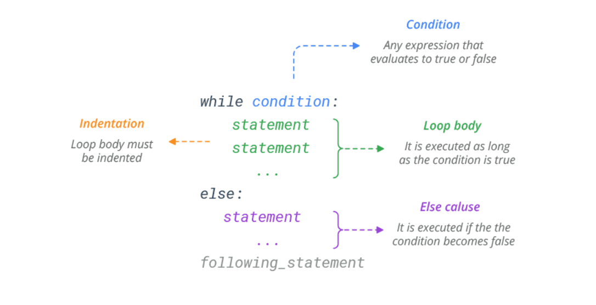

# While Loop

source: `{{ page.path }}`

A while loop is used when you want to perform a task indefinitely, until a particular condition is met. It’s a condition-controlled loop

#### Python While Loop Syntax


Basic Examples
Any non-zero value or nonempty container is considered TRUE; whereas Zero, None, and empty container is considered FALSE.
```python
# Iterate until x becomes 0
x = 6
while x:
    print(x)
    x -= 1
# Prints 6 5 4 3 2 1
# Iterate until list is empty
L = ['red', 'green', 'blue']
while L:
    print(L.pop())
# Prints blue green red
# Iterate until string is empty
x = 'blue'
while x:
    print(x)
    x = x[1:]
# Prints blue
# Prints lue
# Prints ue
# Prints e

If the condition is false at the start, the while loop will never be executed at all.

# Exit condition is false at the start
x = 0
while x:
    print(x)
    x -= 1
```
```python
i=1    
number=0    
b=9    
number = int(input("Enter the number:"))    
while i<=10:    
    print("%d X %d = %d \n"%(number,i,number*i))    
    i = i+1 
output :
Enter the number:10
10 X 1 = 10 
10 X 2 = 20 
10 X 3 = 30 
10 X 4 = 40 
10 X 5 = 50 
10 X 6 = 60 
10 X 7 = 70 
10 X 8 = 80 
10 X 9 = 90 
10 X 10 = 100     
```    
#### Break in while Loop
Python break statement is used to exit the loop immediately. It simply jumps out of the loop altogether, and the program continues after the loop.
```python
# Exit when x becomes 3
x = 6
while x:
    print(x)
    x -= 1
    if x == 3:
        break
# Prints 6 5 4
```
#### Continue in while Loop
The continue statement skips the current iteration of a loop and continues with the next iteration.
```python
# Skip odd numbers
x = 6
while x:
	x -= 1
	if x % 2 != 0:
		continue
	print(x)
# Prints 4 2 0
```
#### Else in While Loop
Python allows an optional else clause at the end of a while loop. The else clause will be executed when the loop terminates normally (the condition becomes false).
```python
## The else clause will be executed when the loop terminates normally
x = 6
while x:
    print(x)
    x -= 1
else:
    print('Done!')
# Prints 6 5 4 3 2 1
# Prints Done!

## The else clause will still be executed if the condition is false at the start.
x = 0
while x:
    print(x)
    x -= 1
else:
    print('Done!')
# Prints Done!

## If the loop terminates prematurely with break, the else clause won’t be executed.

x = 6
while x:
    print(x)
    x -= 1
    if x == 3:
        break
else:
    print('Done!')
# Prints 6 5 4
```
#### Infinte Loop (while true)
The condition must eventually become false. Otherwise, the loop will execute forever, creating an infinite/endless loop.

# Infinte loop with while statement
while True:
    print('Press Ctrl+C to stop me!')
You can safely implement an infinite loop in your program using a break statement.
```python
# Loop runs until the user enters 'stop'
while True:
    name = input('Enter name:')
    if name == 'stop': break
    print('Hello', name)

# Output: 
# Enter name:Bob
# Hello Bob
# Enter name:Sam
# Hello Sam
# Enter name:stop
```