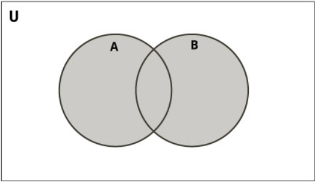
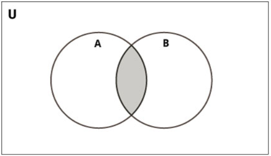
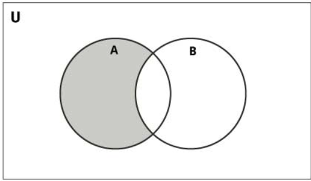
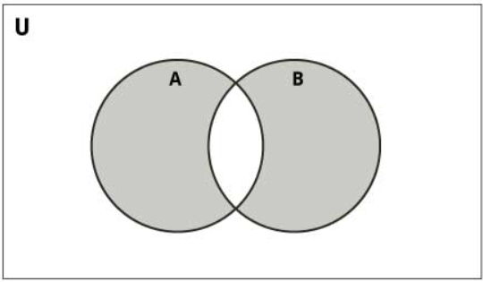

# Sets

source: `{{ page.path }}`

A set object contains one or more items, not necessarily of the same type, which are separated by comma and enclosed in curly brackets {}.

Python set is an unordered collection of unique items. They are commonly used for computing mathematical operations such as union, intersection, difference, and symmetric difference.

```tip
1. sets is a collection of values/elements.
2. sets is represented in {} brackets.
3. sets allows both Homeogenous & Hetrogenous values/elements.
4. sets are mutable.
5. sets doesn't allow duplicate values/elements.
6. sets doesn't allow indexing and slicing.
7. sets doesnot maintain insertion order
```
```note
1. Creating a set
2. Accessing a set
3. Deleting a set
4. Operation on sets
5. The Frozenset
6. Updating a set
7. Functions on sets
8. Methods on sets
9. iterating on sets
```


## Create and Accessing a Set
You can create a set by placing a comma-separated sequence of items in curly braces {}.
```
# A set of strings
S = {'red', 'green', 'blue'}

# A set of mixed datatypes
S = {1, 'abc', 1.23, (3+4j), True}
Sets don’t allow duplicates. They are automatically removed during the creation of a set.

S = {'red', 'green', 'blue', 'red'}
print(S)
# Prints {'blue', 'green', 'red'}

You can also create a set using a type constructor called set().

# Set of items in an iterable
S = set('abc')
print(S)
# Prints {'a', 'b', 'c'}

# Set of successive integers
S = set(range(0, 4))
print(S)
# Prints {0, 1, 2, 3}

# Convert list into set
S = set([1, 2, 3])
print(S)
# Prints {1, 2, 3}

```
## Deleting a set 

```sh
numbers={3,2,1,4,6,5}

1. `discard()` : This method takes the item to delete as an argument.

numbers.discard(3)
print(numbers)
{1, 2, 4, 5, 6}

As you can see in the resulting set, the item 3 has been removed.

2. `remove()`

Like the discard() method, remove() deletes an item from the set.

numbers.remove(5)
print(numbers)
{1, 2, 4, 6}

`discard() vs remove()`-

These two methods may appear the same to you, but there’s actually a difference. 
If you try deleting an item that doesn’t exist in the set, discard() ignores it, 
but remove() raises a KeyError.

numbers.discard(7)
print(numbers)
{1, 2, 4, 6}

print(numbers.remove(7))
Traceback (most recent call last):

File “<pyshell#37>”, line 1, in <module>
numbers.remove(7)
KeyError: 7

3. `pop()`

Like on a dictionary, you can call the pop() method on a set. However, here, it does not 
take an argument. Because a set doesn’t support indexing, there is absolutely no way to
pass an index to the pop method. Hence, it pops out an arbitrary item. Furthermore, it 
prints out the item that was popped.

numbers.pop()
1

Let’s try popping anot/her element.
numbers.pop()
2

Let’s try it on another set as well.
{2,1,3}.pop()
1

4. `clear()`

Like the pop method(), the clear() method for a dictionary can be applied to a Python set as well. It empties the 
set in Python.

print(numbers.clear())

```

```python
## Updating a set
Python set is mutable. But as we have seen earlier, we can’t use indices to reassign it.

numbers={3,1,2,4,6,5}
numbers[3]

File “<pyshell#56>”, line 1, in <module>
numbers[3]
TypeError: ‘set’ object does not support indexing

So, we use two methods for this purpose- add() and update(). We have seen the update()
method on tuples, lists, and strings.

```

```javascript
numbers={3,1,2,4,6,5}

1 . add()  If you add an existing item in the set, the set remains unaffected.

print(numbers.add(3.5))
{1, 2, 3, 4, 5, 6, 3.5}

2. update() This method can add multiple items to the set at once, which it takes as arguments.

print(numbers.update([7,8],{1,2,9}))
{1, 2, 3, 4, 5, 6, 3.5, 7, 8, 9}

```

## set operations

|Method	                            |Description                                                                |
|-----------------------------------|---------------------------------------------------------------------------|
|union()	                        | Return a new set containing the union of two or more sets                 |
|update()	                        | Modify this set with the union of this set and other sets                 |
|intersection()	                    | Returns a new set which is the intersection of two or more sets           |
|intersection_update()	            | Removes the items from this set that are not present in other sets        |
|difference()	                    | Returns a new set containing the difference between two or more sets      |
|difference_update()	            | Removes the items from this set that are also included in another set     |
|symmetric_difference()	            | Returns a new set with the symmetric differences of two or more sets      |
|symmetric_difference_update()	    | Modify this set with the symmetric difference of this set and other set   |
|isdisjoint()	                    | Determines whether or not two sets have any elements in common            |
|issubset()	                        | Determines whether one set is a subset of the other                       |
|issuperset()	                    | Determines whether one set is a superset of the other                     |

``` javascript
A = {1, 2, 3, 4, 5}
B = {4, 5, 6, 7, 8}

Set Union
Union of A and B is a set of all elements from both sets.You can perform union on two or more sets using union() method or  |  operator.
image: 

# by operator
print(A | B)                         # {1, 2, 3, 4, 5, 6, 7, 8}
# by method
print(A.union(B))                    # {1, 2, 3, 4, 5, 6, 7, 8}


Set Intersection
Intersection of A and B is a set of elements that are common in both the sets.
Intersection is performed using & operator. Same can be accomplished using the intersection() method.
image: 

# by operator
print(A & B)                         # {4, 5}
# by method
print(A.intersection(B))             # {4, 5}

Set Difference
Difference of the set B from set A(A - B) is a set of elements that are only in A but not in B. Similarly, 
B - A is a set of elements in B but not in A.

Difference is performed using - operator. Same can be accomplished using the difference() method
image: 

# by operator
print(A - B)                         # {1, 2, 3}
# by method
print(A.difference(B))               # {1, 2, 3}

Symmetric Difference
Symmetric Difference of A and B is a set of elements in A and B but not in both (excluding the intersection).
Symmetric difference is performed using ^ operator. Same can be accomplished using the method symmetric_difference().

image: 

# by operator
print(A ^ B)                         # {1, 2, 3, 6, 7, 8}   
# by method  
print(A.symmetric_difference(B))     # {1, 2, 3, 6, 7, 8}

```