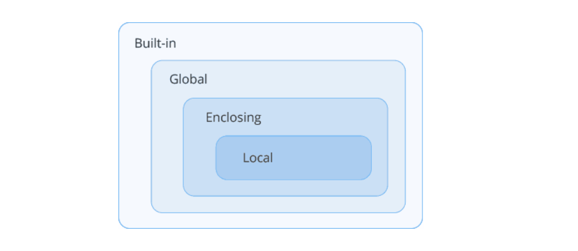

Not all variables are accessible from all parts of our program. The part of the program where the variable is accessible is called its “scope” and is determined by where the variable is declared.

Python has three different variable scopes:

* Local scope
* Global scope
* Enclosing scope

## Local Scope
A variable declared within a function has a LOCAL SCOPE. It is accessible from the point at which it is declared until the end of the function, and exists for as long as the function is executing.
```
def myfunc():
    x = 42      # local scope x
    print(x)

myfunc()        # prints 42
```
Local variables are removed from memory when the function call exits. Therefore, trying to get the value of the local variable outside the function causes an error.
```
def myfunc():
    x = 42      # local scope x

myfunc()
print(x)        # Triggers NameError: x does not exist
```
## Global Scope
A variable declared outside all functions has a GLOBAL SCOPE. It is accessible throughout the file, and also inside any file which imports that file.
```
x = 42          # global scope x

def myfunc():
    print(x)    # x is 42 inside def

myfunc()
print(x)        # x is 42 outside def
```
Global variables are often used for flags (boolean variables that indicate whether a condition is true). For example, some programs use a flag named verbose to report more information about an operation.
```
verbose = True

def op1():
    if verbose:
        print('Running operation 1')
```
## Modifying Globals Inside a Function
Although you can access global variables inside or outside of a function, you cannot modify it inside a function.

Here’s an example that tries to reassign a global variable inside a function.
```
x = 42          # global scope x
def myfunc():
    x = 0
    print(x)    # local x is 0

myfunc()
print(x)        # global x is still 42
```
Here, the value of global variable x didn’t change. Because Python created a new local variable named x; which disappears when the function ends, and has no effect on the global variable.

To access the global variable rather than the local one, you need to explicitly declare x global, using the global keyword.
```
x = 42          # global scope x
def myfunc():
    global x    # declare x global
    x = 0
    print(x)    # global x is now 0

myfunc()
print(x)        # x is 0
```
The x inside the function now refers to the x outside the function, so changing x inside the function changes the x outside it.

Here’s another example that tries to update a global variable inside a function.
```
x = 42          # global scope x

def myfunc():
    x = x + 1   # raises UnboundLocalError
    print(x)

myfunc()
```
Here, Python assumes that x is a local variable, which means that you are reading it before defining it.

The solution, again, is to declare x global.
```
x = 42          # global scope x

def myfunc():
    global x
    x = x + 1   # global x is now 43
    print(x)

myfunc()
print(x)        # x is 43
```
There’s another way to update a global variable from a no-global scope – use globals() function.

##  Enclosing Scope
If a variable is declared in an enclosing function, it is nonlocal to nested functions. It allows you to assign to variables in an outer, but no-global, scope.

Here’s an example that tries to reassign enclosing (outer) function’s local variable inside a nested (inner) function.
```
##### enclosing function
def f1():
    x = 42
    # nested function
    def f2():
        x = 0
        print(x)    # x is 0
    f2()
    print(x)        # x is still 42
    
f1()
```
Here, the value of existing variable x didn’t change. Because Python created a new local variable named x that shadows the variable in the outer scope.

Preventing that behavior is where the nonlocal keyword comes in.
```
##### enclosing function
def f1():
    x = 42
    # nested function
    def f2():
        nonlocal x
        x = 0
        print(x)    # x is now 0
    f2()
    print(x)        # x remains 0
    
f1()
```
The x inside the nested function now refers to the x outside the function, so changing x inside the function changes the x outside it.

The usage of nonlocal is very similar to that of global, except that the former is primarily used in nested methods.

## Scoping Rule – LEGB Rule

image: 

When a variable is referenced, Python follows LEGB rule and searches up to four scopes in this order:

1. first in the local (L) scope,

2. then in the local scopes of any enclosing (E) functions and lambdas,

3. then in the global (G) scope,

4. finally in then the built-in (B) scope

and stops at the first occurrence. If no match is found, Python raises a NameError exception

